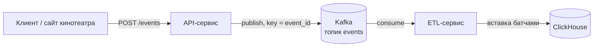

# UGC-аналитика
https://github.com/SiberianFalcon/ugc_sprint_2

Сервис сбора пользовательских действий онлайн-кинотеатра. Состоит из двух
сервисов: API принимает события кликов, просмотров страниц и кастомные
события по HTTP, валидирует их и публикует в Kafka; ETL непрерывно переносит
события из Kafka в аналитическое хранилище ClickHouse.

## Стек

- Python 3.11, FastAPI, Uvicorn;
- aiokafka — публикация в Kafka (идемпотентный продюсер, `acks=all`) и
  чтение событий;
- ClickHouse (`clickhouse-connect`), `aiohttp`;
- psutil — мониторинг потребления памяти ETL;
- pydantic-settings — конфигурация;
- uv (зависимости), ruff, mypy, pytest, pre-commit;
- Архитектура: DDD + Hexagonal + DI-контейнеры.

## Структура проекта

```
ugc_sprint_1/
├── services/
│   ├── api/                      # приём событий -> Kafka
│   │   ├── ddd_plan.md           # доменная модель (DDD)
│   │   ├── Dockerfile
│   │   ├── src/api/
│   │   │   ├── main.py
│   │   │   ├── presentation/     # HTTP: роутеры, схемы, ошибки, DI
│   │   │   ├── application/      # сценарий приёма, порты, DTO
│   │   │   ├── domain/           # Event, Value Objects, правила
│   │   │   └── infrastructure/   # Kafka-продюсер, настройки, контейнер
│   │   └── tests/
│   └── etl/                      # хранилище -> ClickHouse
│       ├── ddd_plan.md
│       ├── Dockerfile
│       ├── src/etl/
│       │   ├── main.py
│       │   ├── composition.py    # сборка сервиса переноса
│       │   ├── application/      # сценарий переноса, маппер, порты
│       │   ├── domain/           # Event, Value Objects, правила
│       │   └── infrastructure/   # Kafka, ClickHouse, мониторинг, настройки
│       └── tests/
├── deploy/clickhouse/            # конфиг доступа к ClickHouse
├── tests/                        # сквозные проверк
├── docker-compose.yml            # api + etl + Kafka + ClickHouse
├── pyproject.toml
├── uv.lock
└── README.md
```

## Требования

### Функциональные (API)

- Приём событий трёх типов:
  - `click`
  - `page_view`
  - `custom`
- Валидация обязательных полей в зависимости от типа события.
- Присвоение идентификатора события, если клиент его не передал.
- Публикация события в Kafka с ключом, равным идентификатору события.
- Возврат подтверждения приёма с идентификатором события.
- Health-эндпоинты для проверки живости и готовности сервиса.

### Нефункциональные (API)

- Идемпотентность доставки: продюсер в идемпотентном режиме,
  `acks=all`, ключ сообщения — `event_id`.
- Производительность: асинхронный приём (FastAPI + aiokafka), рассчитан на
  пиковую нагрузку около 5000 событий/с.
- Отказоустойчивость: проверка доступности Kafka при старте, автоматическое
  переподключение продюсера.
- Наблюдаемость: задел под OpenTelemetry (трассировка, `x-request-id`).
- Качество кода: ruff, mypy, pytest, pre-commit.

### Функциональные (ETL)

- Непрерывное чтение событий из Kafka (consumer group `ugc-etl`).
- Нормализация события в плоскую запись для хранилища.
- Запись событий в ClickHouse батчами (по размеру или таймауту).
- Дедупликация по `event_id` через `ReplacingMergeTree` (чтение с `FINAL`).
- Фиксация offset только после успешной записи батча.
- Непригодные сообщения отправляются в DLQ-топик (`events.dlq`).

### Нефункциональные (ETL)

- Доставка at-least-once; дубли устраняются на стороне хранилища.
- Устойчивость к сбоям: повтор запуска зависимостей и повтор записи батча
  с backoff, без потери событий.
- Мониторинг памяти процесса (psutil): периодический лог и предупреждение
  при превышении порога.

## Оценки нагрузки

| Параметр | Значение |
| --- | --- |
| MAU | ~3 000 000 |
| DAU | ~300 000 |
| Событий на пользователя в день | ~20 |
| Средний RPS | ~70 |
| Пиковый RPS (прайм-тайм) | ~5 000 |
| Средний размер сообщения | ~500 байт |
| Пиковая запись в Kafka | ~2.5 МБ/с |

Средний RPS получен как `DAU * событий_в_день / 86 400`. Пиковый RPS —
с учётом вечернего прайм-тайма (множитель ×20–70 к среднему).

## Архитектура (C4, уровень 2)



## API

Базовый адрес: `http://localhost:8000`. Документация Swagger: `/docs`.

- `POST /events` — принять событие;
- `GET /health/live` — процесс запущен;
- `GET /health/ready` — готовность сервиса.

### Приём события

Запрос `POST /events`:

```json
{
  "event_type": "click",
  "event_id": "необязательно, иначе сгенерируется",
  "event_time": "необязательно, ISO 8601; иначе время приёма",
  "payload": {
    "page_url": "https://example.com/movie",
    "element_id": "play-button"
  }
}
```

Идентификатор пользователя берётся из JWT-токена (`Authorization: Bearer …`),
проверяемого по JWKS (`APP_AUTH_JWKS_URL`). Без токена событие записывается от
анонимного пользователя, невалидный токен возвращает `401`.

Состав `payload` зависит от типа события:

| Тип | Обязательные поля | Опциональные |
| --- | --- | --- |
| `click` | `page_url`, `element_id` | — |
| `page_view` | `page_url` | `duration` |
| `custom` | `event_name` | произвольные поля |

Успешный ответ: `202 Accepted`

```json
{ "event_id": "b53cbf2796624590b2daaf357a2364c6" }
```

Коды ошибок:

- `400` — нарушено доменное правило (неизвестный тип, отсутствует
  обязательное поле);
- `422` — ошибка валидации схемы запроса.

## Запуск

```bash
docker compose up --build
```

Поднимаются четыре сервиса: `kafka` (KRaft), `clickhouse`, `api` и `etl`.
API доступен на http://localhost:8000, ClickHouse — на `127.0.0.1:8123`,
Kafka — на `127.0.0.1:9092`. База данных `ugc` и таблица `events` создаются
автоматически; доступ к ClickHouse настраивается через
`deploy/clickhouse/users.d/default-user.xml`.

## Проверка

Отправка событий:

```bash
curl -s -X POST http://localhost:8000/events \
  -H 'Content-Type: application/json' \
  -d '{"user_id":"user-1","event_type":"page_view","payload":{"page_url":"https://example.com/movie","duration":120}}'

curl -s -X POST http://localhost:8000/events \
  -H 'Content-Type: application/json' \
  -d '{"user_id":"user-2","event_type":"click","payload":{"page_url":"/movie","element_id":"play"}}'
```

Чтение сообщений из топика (ключ = `event_id`):

```bash
docker compose exec kafka \
  /opt/kafka/bin/kafka-console-consumer.sh \
  --bootstrap-server localhost:9092 \
  --topic events --from-beginning --property print.key=true
```

Перенос в ClickHouse (после обработки батча ETL):

```bash
docker compose exec clickhouse clickhouse-client \
  --query "SELECT count() FROM ugc.events FINAL"

docker compose exec clickhouse clickhouse-client \
  --query "SELECT event_id, event_type, user_id FROM ugc.events FINAL ORDER BY event_id"
```

Полная сквозная проверка `api -> kafka`:

```bash
sudo bash tests/verify_task4.sh
```

Полная сквозная проверка `api -> kafka -> etl -> clickhouse` с проверкой
дедупликации:

```bash
sudo bash tests/verify_task6.sh
```

Остановка:

```bash
docker compose down        # остановить
docker compose down -v     # остановить и удалить данные ClickHouse
```

## Переменные окружения

Шаблон — `.env.example`. В Docker Compose адреса задаются в блоке
`environment` соответствующего сервиса.

### API

| Переменная | Назначение | По умолчанию |
| --- | --- | --- |
| `APP_KAFKA_BOOTSTRAP_SERVERS` | адреса брокеров Kafka | `localhost:9092` |
| `APP_KAFKA_TOPIC` | топик для событий | `events` |
| `APP_KAFKA_CLIENT_ID` | идентификатор клиента | `ugc-api` |
| `APP_HOST` | адрес HTTP-сервера | `0.0.0.0` |
| `APP_PORT` | порт HTTP-сервера | `8000` |
| `APP_OTEL_ENABLED` | включает трассировку | `false` |
| `APP_OTEL_SERVICE_NAME` | имя сервиса в трассировке | `ugc-api` |
| `APP_OTEL_EXPORTER_ENDPOINT` | OTLP-эндпоинт коллектора | `http://localhost:4318/v1/traces` |
| `APP_OTEL_SAMPLE_RATIO` | доля трассируемых запросов | `1.0` |

### ETL

| Переменная | Назначение | По умолчанию |
| --- | --- | --- |
| `APP_KAFKA_GROUP_ID` | consumer group ETL | `ugc-etl` |
| `APP_KAFKA_DLQ_TOPIC` | топик непригодных событий | `events.dlq` |
| `APP_KAFKA_CLIENT_ID` | идентификатор клиента | `ugc-etl` |
| `APP_CLICKHOUSE_HOST` | хост ClickHouse | `localhost` |
| `APP_CLICKHOUSE_PORT` | HTTP-порт ClickHouse | `8123` |
| `APP_CLICKHOUSE_DATABASE` | база данных | `ugc` |
| `APP_CLICKHOUSE_TABLE` | таблица событий | `events` |
| `APP_CLICKHOUSE_USERNAME` | пользователь ClickHouse | `default` |
| `APP_CLICKHOUSE_PASSWORD` | пароль ClickHouse | — |
| `APP_BATCH_MAX_SIZE` | максимум событий в батче | `1000` |
| `APP_BATCH_TIMEOUT_SECONDS` | таймаут формирования батча | `5.0` |
| `APP_RETRY_BACKOFF_SECONDS` | пауза между повторами | `5.0` |
| `APP_MONITORING_MEMORY_THRESHOLD_MB` | порог памяти, МБ | `512` |
| `APP_MONITORING_INTERVAL_SECONDS` | период замера памяти | `10.0` |
