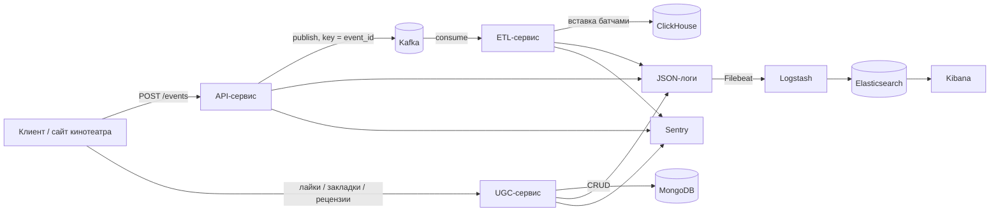

# UGC-аналитика
https://github.com/SiberianFalcon/ugc_sprint_2

Платформа сбора и обработки пользовательских действий онлайн-кинотеатра.
Первый спринт дал конвейер событий (`api -> Kafka -> etl -> ClickHouse`).
Второй спринт доводит систему до продакшн-уровня:

- новый сервис пользовательского контента `ugc` (лайки, закладки, рецензии)
  на MongoDB с подтверждённым нагрузочными тестами выбором хранилища;
- CI/CD в GitHub Actions (линтеры, проверка типов, тесты на нескольких версиях
  Python, уведомление в Telegram);
- централизованное логирование в ELK и мониторинг ошибок в Sentry.

## Стек

- Python 3.11, FastAPI, Uvicorn;
- aiokafka — публикация в Kafka (идемпотентный продюсер, `acks=all`) и
  чтение событий;
- ClickHouse (`clickhouse-connect`), `aiohttp`;
- MongoDB (`motor`/`pymongo`) — хранение пользовательского контента;
- psutil — мониторинг потребления памяти ETL;
- pydantic-settings — конфигурация;
- ELK — Elasticsearch, Logstash, Kibana, Filebeat;
- Sentry SDK (`sentry-sdk`) — мониторинг ошибок;
- Locust — нагрузочное тестирование;
- uv (зависимости), ruff, mypy, pytest, pre-commit;
- Архитектура: DDD + Hexagonal + DI-контейнеры.

## Структура проекта

```
ugc_sprint_2/
├── .github/workflows/            # CI: линтеры, типы, тесты, Telegram
├── services/
│   ├── api/                      # приём событий -> Kafka
│   ├── etl/                      # Kafka -> ClickHouse
│   └── ugc/                      # CRUD контента -> MongoDB
│       ├── ddd_plan.md
│       ├── Dockerfile
│       ├── src/ugc/
│       │   ├── main.py
│       │   ├── presentation/     # HTTP: роутеры, схемы, ошибки, DI
│       │   ├── application/      # сценарии и порты
│       │   ├── domain/           # Like, Bookmark, Review, Value Objects
│       │   └── infrastructure/   # MongoDB, настройки, контейнер, Sentry
│       └── tests/
├── deploy/
│   ├── clickhouse/               # конфиг доступа к ClickHouse
│   └── elk/                      # filebeat.yml и logstash pipeline
├── research/storage/             # сравнение MongoDB и PostgreSQL
├── loadtests/                    # сценарии Locust
├── tests/                        # сквозные проверки
├── docker-compose.yml            # kafka, clickhouse, api, etl, mongo, ugc, ELK
├── pyproject.toml
├── uv.lock
└── README.md
```

## Архитектура (C4, уровень 2)



## Сервис приёма событий (api)

Базовый адрес: `http://localhost:8000`. Документация Swagger: `/docs`.

- `POST /events` — принять событие;
- `GET /health/live` — процесс запущен;
- `GET /health/ready` — готовность сервиса.

Запрос `POST /events`:

```json
{
  "event_type": "click",
  "event_id": "необязательно, иначе сгенерируется",
  "event_time": "необязательно, ISO 8601; иначе время приёма",
  "payload": {
    "page_url": "https://example.com/movie",
    "element_id": "play-button"
  }
}
```

Состав `payload` зависит от типа события:

| Тип | Обязательные поля | Опциональные |
| --- | --- | --- |
| `click` | `page_url`, `element_id` | — |
| `page_view` | `page_url` | `duration` |
| `custom` | `event_name` | произвольные поля |

Успешный ответ — `202 Accepted` с идентификатором события. Доменные ошибки —
`400`, ошибки валидации схемы — `422`.

## Сервис контента (ugc)

Базовый адрес: `http://localhost:8001`. Документация Swagger: `/docs`.

Идентификатор пользователя берётся из JWT-токена (`Authorization: Bearer …`,
проверка по `APP_AUTH_JWKS_URL`). Изменение контента (`PUT/DELETE` лайков и
закладок, `POST/PATCH/DELETE` рецензий) и личные списки (`/likes`, `/bookmarks`,
`/reviews/my`) требуют подтверждённого пользователя и возвращают `401` без
валидного токена. Статус-эндпоинты (`GET /likes/{film_id}`,
`GET /bookmarks/{film_id}`) доступны без токена: счётчик публичен, а
`liked_by_me`/`bookmarked_by_me` равно `false`.

### Лайки

- `PUT /api/v1/likes/{film_id}` — поставить лайк (идемпотентно), `204`;
- `DELETE /api/v1/likes/{film_id}` — снять лайк, `204`;
- `GET /api/v1/likes/{film_id}` — `{film_id, count, liked_by_me}`;
- `GET /api/v1/likes` — список фильмов текущего пользователя.

### Закладки

- `PUT /api/v1/bookmarks/{film_id}` — добавить закладку (идемпотентно), `204`;
- `DELETE /api/v1/bookmarks/{film_id}` — удалить закладку, `204`;
- `GET /api/v1/bookmarks/{film_id}` — `{film_id, count, bookmarked_by_me}`;
- `GET /api/v1/bookmarks` — закладки текущего пользователя.

### Рецензии

- `POST /api/v1/reviews` — создать: `{film_id, rating, text}`, `201`;
- `GET /api/v1/reviews?film_id=&page=&page_size=` — страница рецензий фильма;
- `GET /api/v1/reviews/my` — рецензии текущего пользователя;
- `GET /api/v1/reviews/{review_id}` — рецензия по идентификатору;
- `PATCH /api/v1/reviews/{review_id}` — изменить (только автор);
- `DELETE /api/v1/reviews/{review_id}` — удалить (только автор), `204`.

Коды ошибок: `400` — доменная ошибка, `403` — нет доступа к чужой рецензии,
`404` — рецензия не найдена, `422` — ошибка валидации.

Идемпотентность лайков и закладок обеспечивается уникальным индексом
`(user_id, film_id)` в MongoDB; чтения обслуживаются индексами
`(film_id, kind, created_at DESC)` и `(user_id, created_at DESC)`.

## Исследование выбора хранилища

Выбор MongoDB для пользовательского контента обоснован сравнительным
исследованием с PostgreSQL на датасете 10+ млн записей. Методика и стенд —
в `research/storage/`, полный прогон:

```bash
bash research/storage/run.sh
```

Результаты замеров на датасете 10 млн записей (перцентиль p95, мс;
полная таблица p50/p95/p99 — в `research/storage/README.md`):

| Операция | MongoDB p95 | PostgreSQL p95 | Комментарий |
| --- | --- | --- | --- |
| точечное чтение `(user, film)` | 1.263 | 0.767 | PostgreSQL немного быстрее |
| подсчёт лайков фильма | 0.808 | 21.296 | MongoDB заметно стабильнее |
| список рецензий фильма | 0.866 | 0.514 | сопоставимо |
| upsert действия | 1.601 | 2.173 | MongoDB чуть быстрее |
| удаление действия | 1.784 | 1.724 | сопоставимо |

Вывод: обе базы укладываются в требование чтения < 200 мс. С учётом гибкой
схемы рецензий, идемпотентных upsert и стабильности на подсчётах выбрана
MongoDB. Подробности — в `research/storage/README.md` и
`docs/adr/0001-storage-choice.md`.

## Нагрузочное тестирование API

Сценарии Locust в `loadtests/locustfile.py` покрывают чтение и запись лайков,
закладок и рецензий. Запуск:

```bash
uv run locust -f loadtests/locustfile.py --host http://localhost:8001
```

Headless-прогон с отчётом: см. `loadtests/README.md`.

## Наблюдаемость

### Логирование (ELK)

Сервисы пишут структурированные JSON-логи в stdout с полями `ts`, `level`,
`logger`, `service`, `message` и `request_id` (плюс `method/path/status/
duration_ms` для HTTP). Каждый запрос получает `x-request-id` (входящий
заголовок или сгенерированный), который возвращается в ответе и попадает в
логи. Чувствительные данные (токены) не логируются.

Filebeat собирает логи контейнеров и передаёт в Logstash, который раскладывает
их в Elasticsearch по индексам `%{service}-%{+YYYY.MM.dd}`. Kibana доступна на
http://localhost:5601 (индекс-паттерн `ugc-*`).

### Мониторинг ошибок (Sentry)

`sentry-sdk` подключён во все сервисы. При заданном `APP_SENTRY_DSN` и
`APP_SENTRY_ENABLED=true` события и ошибки уходят в Sentry (облачный DSN или
собственный инстанс). PII отключён (`send_default_pii=False`), заголовок
`Authorization` вырезается через `before_send`. При пустом DSN SDK работает
как no-op.

## CI/CD

`.github/workflows/ci.yml` запускает на push в `main` и pull request:

- `lint` — `ruff check` и `ruff format --check`;
- `typecheck` — `mypy`;
- `test` — `pytest` (unit-тесты) через matrix на Python 3.11 и 3.12;
- `notify` — сообщение о результате в Telegram.

Для Telegram задайте секреты репозитория `TELEGRAM_BOT_TOKEN` и
`TELEGRAM_CHAT_ID`; при их отсутствии шаг пропускается.

## Запуск

```bash
docker compose up --build
```

Поднимаются Kafka (KRaft), ClickHouse, MongoDB, `api`, `etl`, `ugc` и стек
ELK. Адреса: API — http://localhost:8000, UGC — http://localhost:8001,
ClickHouse — `127.0.0.1:8123`, Kafka — `127.0.0.1:9092`, MongoDB —
`127.0.0.1:27017`, Kibana — http://localhost:5601, Elasticsearch —
http://localhost:9200.

## Проверка

Отправка события в `api`:

```bash
curl -s -X POST http://localhost:8000/events \
  -H 'Content-Type: application/json' \
  -d '{"user_id":"user-1","event_type":"page_view","payload":{"page_url":"https://example.com/movie","duration":120}}'
```

Работа с контентом в `ugc`:

```bash
curl -s -X PUT http://localhost:8001/api/v1/likes/film-1
curl -s http://localhost:8001/api/v1/likes/film-1
curl -s -X POST http://localhost:8001/api/v1/reviews \
  -H 'Content-Type: application/json' \
  -d '{"film_id":"film-1","rating":8,"text":"Отличный фильм"}'
```

Сквозные проверки:

```bash
sudo bash tests/verify_task4.sh      # api -> kafka
sudo bash tests/verify_task6.sh      # api -> kafka -> etl -> clickhouse
sudo bash tests/verify_content.sh    # ugc -> mongodb
```

Остановка:

```bash
docker compose down        # остановить
docker compose down -v     # остановить и удалить данные
```

## Переменные окружения

Шаблон — `.env.example`. В Docker Compose адреса задаются в блоке
`environment` соответствующего сервиса.

### API

| Переменная | Назначение | По умолчанию |
| --- | --- | --- |
| `APP_KAFKA_BOOTSTRAP_SERVERS` | адреса брокеров Kafka | `localhost:9092` |
| `APP_KAFKA_TOPIC` | топик для событий | `events` |
| `APP_KAFKA_CLIENT_ID` | идентификатор клиента | `ugc-api` |
| `APP_HOST` | адрес HTTP-сервера | `0.0.0.0` |
| `APP_PORT` | порт HTTP-сервера | `8000` |
| `APP_OTEL_ENABLED` | включает трассировку | `false` |
| `APP_OTEL_SERVICE_NAME` | имя сервиса в трассировке | `ugc-api` |
| `APP_OTEL_EXPORTER_ENDPOINT` | OTLP-эндпоинт коллектора | `http://localhost:4318/v1/traces` |
| `APP_OTEL_SAMPLE_RATIO` | доля трассируемых запросов | `1.0` |

### ETL

| Переменная | Назначение | По умолчанию |
| --- | --- | --- |
| `APP_KAFKA_GROUP_ID` | consumer group ETL | `ugc-etl` |
| `APP_KAFKA_DLQ_TOPIC` | топик непригодных событий | `events.dlq` |
| `APP_KAFKA_CLIENT_ID` | идентификатор клиента | `ugc-etl` |
| `APP_CLICKHOUSE_HOST` | хост ClickHouse | `localhost` |
| `APP_CLICKHOUSE_PORT` | HTTP-порт ClickHouse | `8123` |
| `APP_CLICKHOUSE_DATABASE` | база данных | `ugc` |
| `APP_CLICKHOUSE_TABLE` | таблица событий | `events` |
| `APP_CLICKHOUSE_USERNAME` | пользователь ClickHouse | `default` |
| `APP_CLICKHOUSE_PASSWORD` | пароль ClickHouse | — |
| `APP_BATCH_MAX_SIZE` | максимум событий в батче | `1000` |
| `APP_BATCH_TIMEOUT_SECONDS` | таймаут формирования батча | `5.0` |
| `APP_RETRY_BACKOFF_SECONDS` | пауза между повторами | `5.0` |
| `APP_MONITORING_MEMORY_THRESHOLD_MB` | порог памяти, МБ | `512` |
| `APP_MONITORING_INTERVAL_SECONDS` | период замера памяти | `10.0` |

### UGC (MongoDB)

| Переменная | Назначение | По умолчанию |
| --- | --- | --- |
| `APP_MONGO_URI` | URI MongoDB | `mongodb://localhost:27017` |
| `APP_MONGO_DATABASE` | база данных | `ugc` |
| `APP_MONGO_LIKE_COLLECTION` | коллекция лайков | `likes` |
| `APP_MONGO_BOOKMARK_COLLECTION` | коллекция закладок | `bookmarks` |
| `APP_MONGO_REVIEW_COLLECTION` | коллекция рецензий | `reviews` |
| `APP_HOST` | адрес HTTP-сервера | `0.0.0.0` |
| `APP_PORT` | порт HTTP-сервера | `8001` |

### Аутентификация (api и ugc)

| Переменная | Назначение | По умолчанию |
| --- | --- | --- |
| `APP_AUTH_JWKS_URL` | URL JWKS для проверки токенов | — |
| `APP_AUTH_ISSUER` | издатель токенов | `auth-service` |
| `APP_AUTH_TIMEOUT_SECONDS` | таймаут запроса JWKS | `5.0` |

### Sentry (все сервисы)

| Переменная | Назначение | По умолчанию |
| --- | --- | --- |
| `APP_SENTRY_DSN` | DSN проекта Sentry | — |
| `APP_SENTRY_ENABLED` | включает отправку в Sentry | `false` |
| `APP_SENTRY_ENVIRONMENT` | окружение | `development` |
| `APP_SENTRY_TRACES_SAMPLE_RATE` | доля трассировок | `0.0` |
